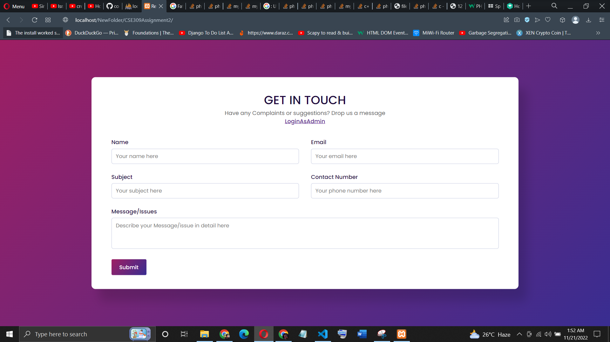
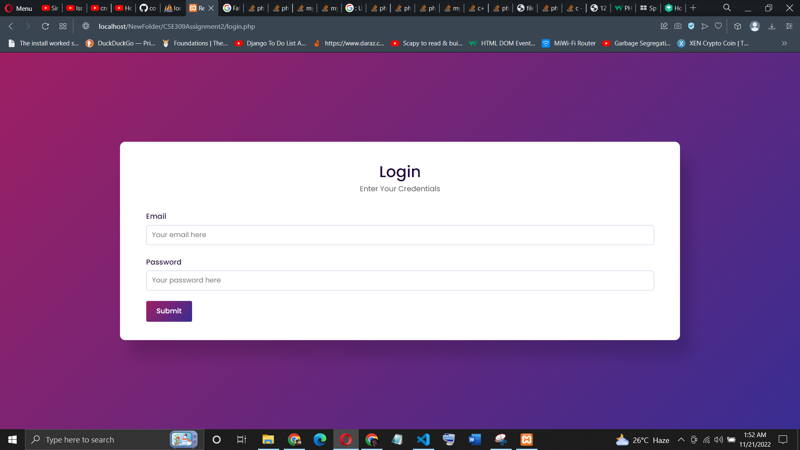
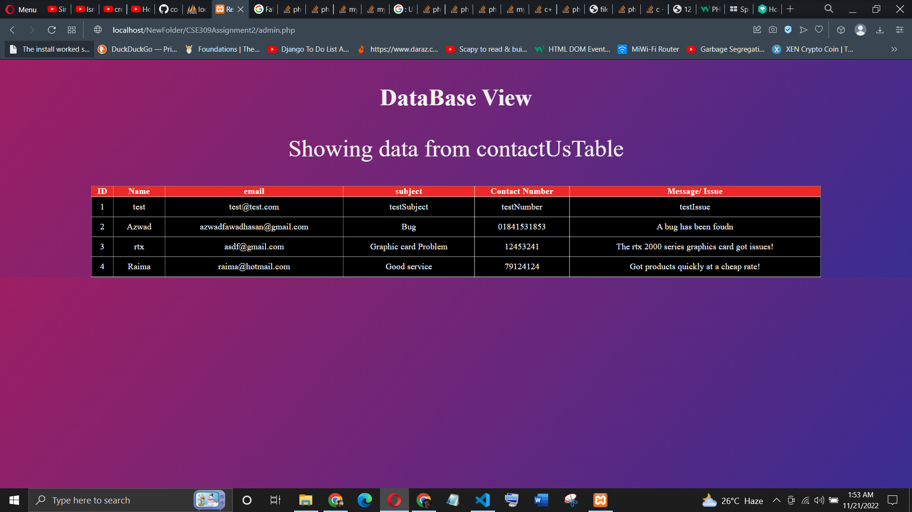
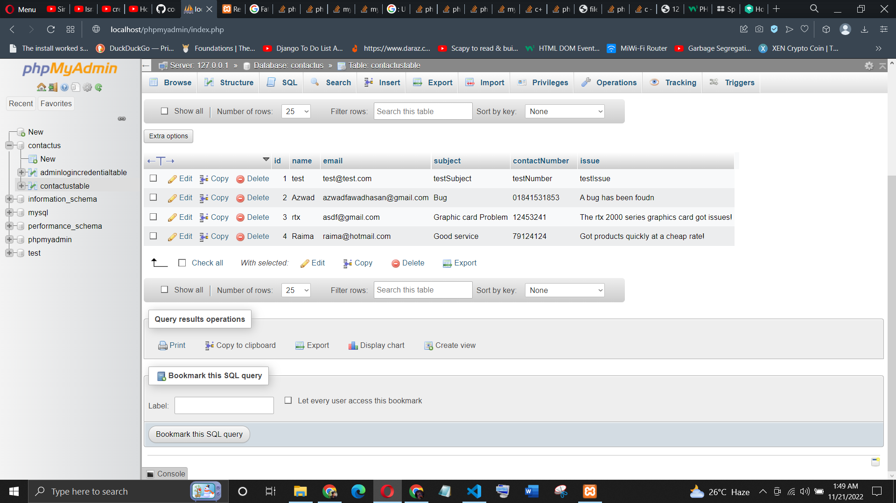

# CSE309Assignment2
This repo contains  a responsive contact us form.
# Task
1. Create a responsive contact us form.
2. Send the contact us form's data to database.
3. Create an admin login panel. 
4. After successful login show the details of the contact form serially. 

Admin panel's user name and password can be pre-defined and stored in the database manually. 

# How To Open The Project
install XAMPP
Go To htdocs folder inside c:\\xampp
clone the project inside htdocs directory
open localhost
Done!

## Pictures

